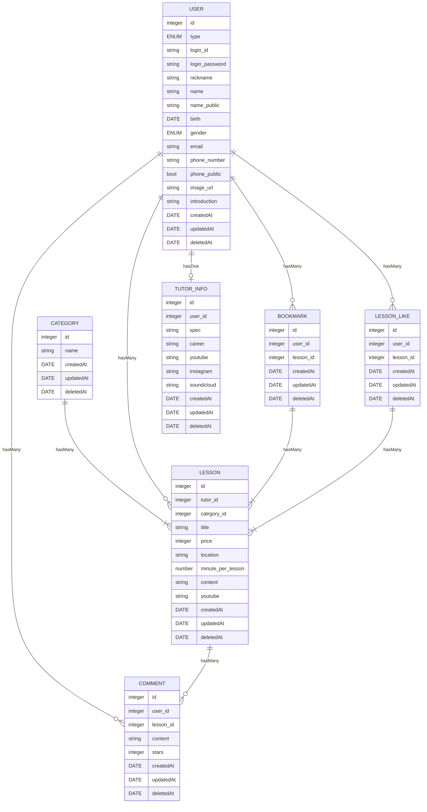

# 데이터베이스
MariaDB를 사용합니다.

## ER 다이어그램

- 마크다운 기반의 mermaid를 사용하였습니다.
    - [https://mermaid-js.github.io/mermaid/#/](https://mermaid-js.github.io/mermaid/#/)
- 선정 이유
    - 마크다운 편집기 혹은 뷰어에서 mermaid를 지원한다면 어디서든 출력 가능합니다.
    - 마크다운 기반 코드이므로 문법이 단순하며 편집 및 수정도 단순합니다.

